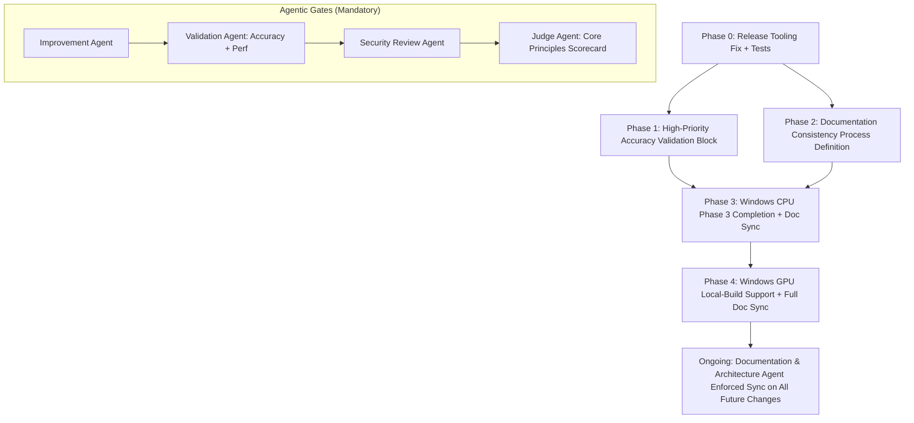
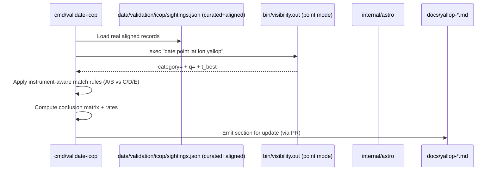
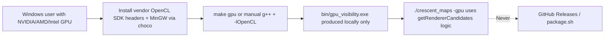

# Roadmap & Execution Plan: Windows GPU (OpenCL) Support, High-Priority Accuracy Validation, Release Tooling Fixes, and Documentation Consistency

**Author**: Systems Architect (AI-assisted, following crescent-moon-visibility-engineering skill patterns)  
**Date**: 2026-05-26 (initial draft); revised 2026-05-26 post-review (v1.1, addressed all 5 minor issues from grok-design-review-afd6ed6e.md)  
**Status**: Draft (post-review revision)  
**Version**: Targeting post-0.5.4-rc.2 work (current VERSION: 0.5.4-rc.2)  
**Related**: TODO.md (High/Medium items from May 2026 agentic review), README.md §Architecture/§Release Process, docs/performance-accuracy.md, docs/yallop-criteria-and-external-validation.md, scripts/release.sh, .github/workflows/release.yml, Makefile, main.go:getRendererCandidates, cmd/validate-icop/, gpu/, internal/blend/

---

## Overview

This design document defines a prioritized, phased roadmap to complete outstanding TODO items while rigorously upholding the project's non-negotiable **Accuracy First** Core Principle. The effort comprises four tightly-scoped workstreams:

1. **High-Priority Accuracy Validation** (ICOP external harness hardening + HMNAO/UKHO baseline + sighting alignment).
2. **Release Tooling Hygiene** (fix the known `scripts/release.sh` prerelease bump bug that breaks `make release-rc` / `--beta` when VERSION is already e.g. 0.5.4-rc.2).
3. **Documentation Consistency & Phase 3 Completion** (finish Windows CPU local-build docs, establish permanent cross-document sync process owned by the Documentation & Architecture Agent role).
4. **Windows GPU (OpenCL) Phase 4** (pragmatic local-build support + excellent documentation only; **no** prebuilt binaries in releases, **no** addition to public GitHub Actions matrix).

All significant changes will execute the project's mandatory 4-stage agentic workflow (Improvement Agent → Validation Agent → Security Review Agent → Judge Agent), with the Judge exercising final authority and explicit Core Principles scorecard scoring. The document provides concrete PR-level granularity, Mermaid diagrams for dependencies and documentation flows, quantified token estimates (accounting for full agentic reviews), and explicit alignment to existing code paths (e.g., `main.go:202-234` (renderer selection logic), `gpu/gpu_render.c:279-285` (FP64 detection + use_fp32_kernel assignment), `Makefile:66-88` (GPU_SUPPORTED detection block), `scripts/package.sh:19-20` GPU exclusion policy). Line citations verified against the 0.5.4-rc.2 tree during post-review polish.

Expected outcome: a trustworthy external validation story (closing the largest Accuracy First gap), a robust release process, complete and perpetually consistent documentation, and Windows users able to build the existing portable GPU kernels locally on NVIDIA/AMD/Intel hardware using MinGW + vendor SDKs.

---

## Background & Motivation

### Current State (v0.5.4-rc.2)
- **Windows CPU**: Phases 1 (on-push CI matrix in `.github/workflows/build.yml`) and 2 (release integration in `.github/workflows/release.yml` + `scripts/package.sh` + Windows-aware `main.go:getRendererCandidates` + `runtime.GOOS` discovery) are shipping. Phase 3 (documentation + local build instructions) is explicitly "in progress" in TODO.md. README.md contains Windows usage examples and CPU-only caveats but lacks a dedicated "Building from source on Windows" subsection with MinGW/choco steps, OpenMP fallback details, and cross-references to the Windows CI commands. Makefile remains Unix-centric (heavy `uname -s` + Homebrew/ROCm/CUDA detection; no Windows MinGW section).
- **Release tooling bug** (`scripts/release.sh:95-100`): When a bump type (patch/minor/major) and prerelease flag are supplied (as in `make release-rc` which invokes `patch --rc`), `bump_version` is invoked on the (possibly prerelease-containing) `CURRENT_VERSION` before `parse_prerelease` is ever consulted. The `IFS='.' read` on line 32 followed by arithmetic `$((patch + 1))` at line 45 chokes on `4-rc.2`, producing a syntax error such as "invalid arithmetic operator (error token is \".1\")". `parse_prerelease` (which contains logic for existing prereleases at lines 64-72) is never reached from the `--rc` path when starting from an rc. Workaround (explicit `./scripts/release.sh 0.5.4-rc.3`) is fragile.
- **Accuracy Validation**: `cmd/validate-icop/main.go` (and `internal/validation/icop/`) currently loads `data/validation/icop/sightings.json` (8 curated but non-aligned mock/test records per the ICOP README and TODO). The harness calls the exact renderer in "point" mode but reports 0% match rates because dates/locations do not correspond to real conjunction times. Categories C/D/E are ignored in match logic (lines 84-89). No HMNAO/UKHO published prediction ingestion exists. This is called out as the single largest gap for "Accuracy First" in the May 2026 agentic review (TODO.md lines 28-43).
- **Windows GPU**: Kernels (`gpu/visibility_kernel.cl`, `visibility_kernel_fp32.cl`) and host (`gpu/gpu_render.c`) are largely portable (standard OpenCL C + minimal `#ifdef __APPLE__` include only; FP64 detection at 279-285). `main.go:202-234` (selection) + 63-78 already handles `gpu_visibility` discovery with Windows candidates. However, Makefile has zero Windows OpenCL support, `package.sh:19-20` and `release.yml:232` explicitly exclude GPU binaries, and no Windows build instructions or MinGW+SDK notes exist. GitHub Windows runners have no GPUs. Official policy (README:249, package.sh, release notes) is "local build only — no prebuilts."
- **Documentation**: Multiple files must stay synchronized (README.md Architecture + Setup sections, three docs/*.md files, TODO.md, CHANGELOG.md, release notes body in `.github/workflows/release.yml`, Makefile comments, the `crescent-moon-visibility-engineering` skill, and internal AGENTIC_WORKFLOW.md). Current gaps exist around Windows Phase 3 and external validation status. The Documentation & Architecture Agent role is referenced in `docs/yallop-criteria-and-external-validation.md:219` but has no codified process, triggers, or ownership in public files.

### Pain Points & Why Now
- Accuracy First is violated by the absence of systematic external evidence (self-consistency at 96.97% is necessary but insufficient).
- Release process fragility blocks smooth pre-release cadence.
- Incomplete Windows CPU docs + absent Windows GPU local-build path harm Modularity & Portability and user experience.
- Without an explicit Documentation & Architecture Agent process, future changes (math, platform support, validation results) will cause drift (historical pattern observed in 0.3.0–0.5.x refreshes).

Token context for AI-driven work (per prior analysis): small hygiene items ~10-18k total tokens; High-Priority Accuracy block 55-95k (large due to validation harness + real data curation + full Judge reviews); pragmatic Windows GPU 28-55k; full remaining work 140-250k+ across 4-stage reviews.

---

## Goals & Non-Goals

### Goals
- Complete the three High Priority accuracy items from TODO.md (ICOP harness, HMNAO baseline, match logic hardening) with real, reproducible evidence and ≥1 automated or documented regression path.
- Fix the `scripts/release.sh` prerelease bump bug with tests; update Makefile targets and docs.
- Finish Windows CPU Phase 3 (complete "Building from source on Windows" in README + Makefile notes + cross-refs) and codify a permanent Documentation & Architecture Agent process (triggers, ownership, sync checklist, cross-refs to engineering skill).
- Deliver scoped Windows GPU Phase 4: MinGW + vendor SDK local-build instructions + minimal Makefile enhancements + runtime verification (no behavior change). Excellent, tested documentation. Update all affected docs consistently.
- Every significant artifact (code, docs, scripts) passes the 4-stage agentic workflow with explicit Accuracy First + Verifiability scoring by the Judge.
- Produce a concrete, ordered PR Plan of independently reviewable changes.

### Non-Goals (Explicit Boundaries)
- **Windows GPU**: No prebuilt `gpu_visibility*.exe` artifacts in GitHub releases or `package.sh`. No addition of Windows GPU jobs to public `.github/workflows/*.yml` matrix (requires self-hosted runners with GPUs; out of scope). No changes to the FP32+DD or Chebyshev logic (already portable).
- No new visibility criteria implementation (Medium priority; deferred until after high-priority validation).
- No golden sighting dataset or dynamic grid metadata headers (Medium; separate roadmap).
- No changes to release policy for macOS or Linux GPU (local-build only remains).
- No full ICOP database ingestion or web scraping (only curated, version-controlled subset under strict provenance rules per `data/validation/icop/README.md`).
- No modifications to `internal/blend` or CPU reference math in this roadmap (those require separate Accuracy First reviews).

---

## Proposed Design

### High-Level Phasing & Dependencies
The work is sequenced to protect Accuracy First (validation first) while allowing parallelizable hygiene where safe.



**Phase ordering rationale**: The release bug is small and blocking; accuracy validation is the highest-value Accuracy First work and has no dependency on Windows GPU; doc process definition enables safe parallel doc work; Windows CPU docs can land early; Windows GPU (low risk, local-only) is last so its documentation can reference a mature validation story.

### 1. Release Tooling Fix (scripts/release.sh)
- Modify control flow: when the requested bump type is patch/minor/major and a prerelease flag is present, detect whether `CURRENT_VERSION` already matches `X.Y.Z-(rc|beta|alpha).N` via regex (reuse/extend `parse_prerelease` logic) *before* invoking `bump_version`.
- If prerelease bump requested on an existing prerelease of the same kind, skip `bump_version` entirely and call an enhanced `increment_prerelease` directly.
- Add unit-test-like coverage via a small shell test harness or `make test-release-script` target (invoking the script in a temp git repo).
- Update Makefile release-rc/beta targets comments and README §Release Process examples.
- **Risk**: Low. Mitigation: test on current 0.5.4-rc.2 state before landing.

### 2. High-Priority Accuracy Validation
- **ICOP Harness Hardening** (`cmd/validate-icop/main.go`, `internal/validation/icop/{icop.go,compute.go}`):
  - Replace/expand `sightings.json` with real, provenance-checked records aligned to actual astronomical conjunction times (use `internal/astro` or renderer "point" mode + Astronomy Engine to compute exact new-moon + day offsets for each sighting date).
  - Harden match logic to correctly handle instrument (naked_eye → A/B only; binoculars/telescope → include C/D/E with documented thresholds). Produce confusion matrix + per-category precision/recall.
  - Add `make validate-icop` (already present) + optional `--report` flag for machine-readable JSON summary.
  - Add regression test hook (or documented golden output) guarded by `RUN_EXTERNAL_VALIDATION=1`.
- **HMNAO/UKHO Baseline**: New small CLI or Go package (or extension to validate-icop) that ingests published HMNAO crescent tables (manual curation of 10-20 dates initially, or scripted fetch of known public PDFs with strict attribution). Compare first-visibility longitude, category boundaries, and ARCV predictions. Document systematic differences.
- **Quantification targets**: Curated ICOP set of 30–60 high-quality records (growing from current 8); HMNAO comparison on ≥15 lunations; public report in `docs/yallop-criteria-and-external-validation.md` update + summary in release notes.
- All changes go through full 4-stage review; Validation Agent will re-run `make test-accuracy` + new harness.

**Data flow (validation)**:


### 3. Documentation Consistency Process
- Define **Documentation & Architecture Agent** responsibilities (codified in a new or expanded section of the engineering skill + public TODO/AGENTIC_WORKFLOW references).
- **Triggers** for mandatory sync (any one fires a Documentation & Architecture review pass):
  - Any change to visibility math (CPU/GPU kernels, visibility.cc, yallop cubic).
  - Platform support changes (new Windows GPU instructions, Makefile OpenCL updates, runtime.GOOS logic).
  - Validation harness or external baseline results.
  - Release process / package layout changes.
  - Architecture diagram or performance numbers updates.
- **Sync Checklist** (enforced in every significant PR and by Judge; 9+ files):
  - README.md Architecture, Setup, Release Process, Testing sections (including repair of any pre-existing dangling internal anchors such as `#building-from-source`).
  - All three docs/*.md (update "Document status" footers + cross-refs).
  - New public `docs/documentation-maintenance.md` (triggers, checklist, human-oriented guidance; see Issue 3 resolution below).
  - TODO.md (move completed items, update "Last Updated").
  - CHANGELOG.md + release notes body in release.yml.
  - Makefile comments + `make agentic-review` output.
  - scripts/release.sh + package.sh comments.
  - CONTRIBUTING.md (reference the public maintenance doc).
  - References back to `crescent-moon-visibility-engineering` skill.
  - Audit step: "Verify all internal Markdown anchors resolve (e.g., no dangling `#building-from-source`)."
- Use `todo_write` (or equivalent) for multi-phase doc work inside agentic sessions.
- Always verify with `make`, `make test`, `make test-accuracy`, and (for validation) `make validate-icop`.

**Documentation Update Process Flow**:
```mermaid
flowchart TD
    Change[Proposed change to code/math/platform/validation] --> Trigger{Does trigger apply?}
    Trigger -->|Yes| DocAgent[Documentation & Architecture Agent reviews full set]
    DocAgent --> Checklist[Apply 9+-file sync checklist (incl. new public doc + anchor audit)]
    Checklist --> Agentic[Full 4-stage agentic workflow including Doc Agent]
    Agentic -->|Judge approves| Merge[Land + update "Last Updated" / footers]
    Agentic -->|Revisions| DocAgent
```

### 4. Windows GPU (OpenCL) Phase 4 — Pragmatic Local-Only Scope
- **Runtime readiness**: Already present (`main.go` discovery + `gpu_render.c` host + standard kernels). No code changes to kernels or Chebyshev logic required.
- **Build support**:
  - Extend Makefile with a guarded Windows MinGW section (detect via `GOOS` or explicit `WINDOWS=1` or `uname` fallback; document `make gpu WINDOWS=1` or equivalent after `choco install mingw opencl-sdk`).
  - Provide minimal `gpu/gpu_render.c` adjustments only for include paths if needed (vendor SDKs install to standard locations under MinGW).
  - Document exact commands for NVIDIA CUDA Toolkit OpenCL, AMD ROCm/OpenCL, Intel oneAPI/OpenCL on Windows.
- **Documentation** (primary deliverable):
  - New "Building from source on Windows" subsection in README (MinGW install via choco, CGO setup, OpenMP fallback, OpenCL SDK per vendor, `make cpu` / `make gpu` / `make go`, verification with `-gpu`).
  - Update GPU dependency table.
  - Add Windows GPU notes to package.sh QUICKSTART (local-only), release.yml body, performance-accuracy.md (cross-platform note), yallop doc.
  - Explicit statement: "Windows GPU binaries are never shipped in releases. Users on real NVIDIA/AMD/Intel Windows hardware build locally."
- **Verification**: Local build + accuracy run on at least one Windows + discrete GPU configuration (report in PR); existing `TestRendererAccuracy` continues to protect 96.97%+ match. *Pragmatic note for PR 6 (addressing review feedback)*: If a real-hardware Windows + discrete GPU run is unavailable during the PR (e.g., AI agentic session without access to such hardware), the PR must (a) document the exact MinGW + vendor SDK commands attempted (even if cross-compile or partial), (b) re-run the full `make test-accuracy` + `make validate-icop` suite on the PR author's primary platform as a strong proxy, and (c) include a clear note "Windows GPU local-build instructions validated via documentation review + Unix-side accuracy gate; real-hardware confirmation targeted as follow-up issue." This preserves the Accuracy First gate while remaining executable.
- **Risks & Mitigations** (explicit):
  - **Medium**: Vendor SDK header/lib discovery variance on Windows. Mitigation: precise per-vendor instructions + "best effort" Makefile target that fails gracefully with clear error.
  - **Low**: OpenCL ICD/driver issues on user machines. Mitigation: same "local build only" policy as macOS; no CI enforcement.
  - **Low**: Slight divergence in Windows OpenCL vs Linux/macOS. Mitigation: FP64 detection path already proven on multiple platforms; accuracy regression test remains the gate.
  - **Low (execution)**: Real Windows + discrete GPU hardware may be unavailable to the PR author for live verification. Mitigation: the pragmatic fallback procedure documented above; macOS "local only" precedent has succeeded without CI prebuilts.

**Windows GPU local build data flow (no release path)**:


---

## API / Interface Changes

- **No public API changes** to CLI flags, Go packages (beyond internal validation), or renderer command lines.
- Minor: `make validate-icop` may gain `--report=json` flag (additive).
- `scripts/release.sh` internal functions refactored (parse/bump logic); usage examples unchanged.
- Makefile: new optional Windows GPU build path (additive, guarded).
- No changes to `internal/blend` or kernel ABIs.

**Before/After example (release.sh behavior)**:

Before (on 0.5.4-rc.2 + `make release-rc`):
```
$ ./scripts/release.sh patch --rc
# fails in bump_version arithmetic on "4-rc.2"
```

After:
```
$ ./scripts/release.sh patch --rc
Bumping patch on existing prerelease: 0.5.4-rc.2 → 0.5.4-rc.3
# succeeds, tags v0.5.4-rc.3
```

---

## Data Model Changes

- **ICOP sightings.json**: Expanded/curated with real aligned records (added fields or companion metadata for conjunction time if needed for diagnostics; schema in `internal/validation/icop/icop.go` remains stable). Migration: manual curation + PR review under Accuracy First; old mock records may be archived in git history or a `testdata/` subdir with explicit "do not use for validation" marker.
- No schema changes to renderer `.bin` outputs, WEBP, or Chebyshev coefficients.
- New optional machine-readable output from validation harness (JSON summary) — purely additive.

---

## Alternatives Considered

### Alt 1: Full Windows GPU CI + Release Artifacts
Build Windows GPU binaries on self-hosted runners or via cloud Windows GPU VMs and ship them.
- **Pros**: Users get turnkey `-gpu` on Windows.
- **Cons**: Violates "local build only" policy established for macOS and explicitly recommended for Windows; dramatically increases attack surface (OpenCL driver + vendor SDK in release pipeline); requires ongoing maintenance of GPU runners; conflicts with Minimalism & Portability and the existing `package.sh` / release.yml exclusions. High operational cost.
- **Decision**: Rejected. Scope limited to local-only as stated in prompt and current policy.

### Alt 2: Defer All Windows GPU Work Indefinitely + Minimal Doc Fix Only
Do only the release bug fix + accuracy validation + Phase 3 CPU docs; leave GPU Phase 4 as a forever-placeholder.
- **Pros**: Smaller immediate surface area.
- **Cons**: Leaves a documented "Phase 4 (optional, later)" item incomplete despite kernels already being portable and `main.go` ready. Harms the "Modularity & Portability" principle for a major desktop OS. Windows users with discrete GPUs have no path documented, creating support burden.
- **Decision**: Rejected in favor of pragmatic, well-documented local-build support (low risk, high documentation value).

### Alt 3: Single Massive "Everything" PR
Land release fix + full validation harness rewrite + all doc updates + Windows GPU in one PR.
- **Pros**: Atomic.
- **Cons**: Violates "independently reviewable PRs" requirement; defeats staged agentic reviews; impossible for Judge to give focused Accuracy First scorecard on 100k+ token changes.
- **Decision**: Rejected. Strict incremental PR Plan required.

---

## Security & Privacy Considerations

- **Release tooling fix**: Touches `scripts/release.sh` (called out in its header for Security Review + Judge attention). Change is narrow (control-flow + regex); no new external commands or secret handling. Full Security Review Agent pass required.
- **Validation harness**: Ingests only curated, public-domain ICOP-derived records (already version-controlled with strict provenance). No new network calls in the default path; HMNAO ingestion will be offline/curated initially. No PII.
- **Windows GPU build docs**: Only instruct users to install vendor SDKs from official sources (NVIDIA/AMD/Intel). No new binaries or download steps introduced by the project.
- **Cosign / supply chain**: Unaffected. Existing keyless signing in release.yml remains the verification story.
- Threat model: Low incremental risk. Primary new surface is documentation that could mislead users into unsafe SDK installs — mitigated by precise, vendor-official links and warnings.

All changes require the full 4-stage agentic workflow (Security Review Agent explicitly reviews release.sh and any new executable paths).

---

## Observability

- **Build / Release**: Existing GitHub Actions logs + Cosign signatures. Post-fix, pre-release tags will succeed reliably (alert on failed tag push in maintainer workflows).
- **Validation harness**: New `--report` JSON output + summary stats printed on `make validate-icop`. Add lightweight logging of match rates to stdout for CI scraping if a future `make validate-icop-ci` target is added.
- **Accuracy regression**: `make test-accuracy` (TestRendererAccuracy) remains the primary automated signal (≥96% guard). Validation results will be committed as updated docs + (optionally) golden JSON.
- **Alerting**: No new production services. Maintainer attention via PR reviews and periodic re-runs of the ICOP harness on new curated data drops.
- Metrics of interest (for future expansion): ICOP match rate per category, HMNAO boundary delta (degrees longitude), Windows GPU local-build success anecdotes (via issues).

---

## Rollout Plan

1. **PR 1 (Release fix)**: Small, isolated. Land after single focused agentic pass. Immediately unblocks pre-release cadence.
2. **PRs 2–4 (Accuracy block)**: Staged — harness skeleton + data alignment first (Validation Agent heavy), then HMNAO ingestion, then final reporting + doc updates. Full Judge scorecard on Accuracy First + Verifiability after each major increment.
3. **PR 5 (Doc process + Phase 3 Windows CPU docs)**: Can land in parallel with early accuracy work. Enforces future discipline.
4. **PR 6+ (Windows GPU local docs + minimal Makefile)**: Final. Includes local verification on real hardware; explicit policy restatement in all docs.
5. **Feature flags / staging**: None required (no runtime flags). All changes are additive or bug fixes.
6. **Rollback**: Git revert + re-tag is sufficient for all components. Validation harness is additive (`make validate-icop` is opt-in). Documentation drift is corrected by subsequent Documentation & Architecture Agent passes.
7. **Post-rollout**: Update TODO.md "Last Updated", run full accuracy + validation suite on main, publish summary in next release notes.

---

## Open Questions

1. Exact target size and selection criteria for the final curated ICOP set (30 vs 60 records) — to be decided during first Improvement/Validation Agent pass on the accuracy work.
2. Preferred format and update cadence for HMNAO comparison tables (embedded Markdown table vs separate CSV + generator script).
3. Whether the Documentation & Architecture Agent process should be codified in a new public `docs/documentation-maintenance.md` or remain primarily in the (internal) engineering skill + AGENTIC_WORKFLOW.md with strong public README/TODO pointers.  
   **Resolution (post-review, Issue 3)**: Adopt the hybrid public doc approach. PR 5 will create `docs/documentation-maintenance.md` (human/self-service content: triggers, checklist, anchor audit, CONTRIBUTING update) while noting that full agentic session details and the `crescent-moon-visibility-engineering` skill remain internal (consistent with existing exclusion of AGENTIC_WORKFLOW.md etc.). This is called out in the updated PR 5 description and Sync Checklist. Open Question considered addressed for the design.
4. Level of detail for per-vendor Windows OpenCL SDK install steps (one canonical "NVIDIA example" + pointers, or exhaustive matrix?).

These will be resolved via the agentic process itself (Improvement Agent will surface concrete proposals for Judge decision).

---

## References

- `TODO.md` (High Priority accuracy items + Windows phases + release bug, May 2026 agentic review notes)
- `README.md` (Architecture §10-38, Windows CPU notes, Release Process, GPU dependency table, macOS local-build policy)
- `docs/performance-accuracy.md` (96.97% numbers, FP32+DD rationale, future work list)
- `docs/yallop-criteria-and-external-validation.md` (external validation gap §4.3, recommended next steps §8, Documentation & Architecture Agent reference)
- `docs/visibility-criteria-comparison.md`
- `scripts/release.sh` (bump_version:32 + arithmetic at 45, parse_prerelease:64-72, main flow:95-100; error token behavior verified)
- `.github/workflows/release.yml` (Windows matrix, package assembly, GPU exclusion text, release notes body)
- `.github/workflows/build.yml` (MinGW + Windows CPU renderer build commands)
- `Makefile` (agentic-review target, GPU_SUPPORTED detection at 66-88, release-* targets, package target)
- `scripts/package.sh` (GPU exclusion rationale lines 19-20, Windows naming)
- `main.go` (getRendererCandidates:63-78, GPU/CPU dispatch selection:202-234, version reporting)
- `cmd/validate-icop/main.go` + `internal/validation/icop/{icop.go,compute.go}`
- `data/validation/icop/{README.md, sightings.json}`
- `gpu/gpu_render.c` (FP64 detection + use_fp32_kernel:279-285 and comment block from 276, host portability + __APPLE__ include guard)
- `gpu/visibility_kernel*.cl` (standard OpenCL C portability notes)
- `internal/blend/blend.go` + `blend_test.go` (pure-Go portability + accuracy test)
- `CHANGELOG.md` (Windows CPU history, doc refresh patterns)
- `CONTRIBUTING.md` (basic doc update expectation)
- `crescent-moon-visibility-engineering` skill (internal; referenced throughout for architecture patterns + agentic roles)
- AGENTIC_WORKFLOW.md + `scripts/agents/judge-agent.md` (private; 4-stage definition + Core Principles Scorecard)
- Prior agentic reviews (2026-05-24/25) recorded in TODO.md and internal artifacts

---

## Key Decisions (with Rationale)

1. **Windows GPU must remain local-build only (no release artifacts, no public CI)**: Directly follows existing macOS policy, `package.sh` and `release.yml` text, and the prompt's "Pragmatic scoping". Protects Minimalism, supply-chain attack surface, and operational simplicity. Documentation excellence compensates for lack of prebuilts.

2. **Accuracy validation block takes precedence over Windows GPU**: Per Core Principles ordering (Accuracy First > everything). External evidence is the largest current gap; Windows GPU kernels are already portable and low-risk.

3. **Release bug fix is first (smallest) PR**: Unblocks all pre-release work; touches a file already under Security/Judge scrutiny; minimal token cost.

4. **Codify Documentation & Architecture Agent process now**: Prevents future drift at the exact moment multiple docs (Windows, validation results, architecture) will change. Uses `todo_write` for multi-phase doc work as required by the skill.

5. **Token estimates must include full 4-stage reviews**: Historical data shows each significant change (especially accuracy + validation) consumes 2–4× the raw diff size in agent conversation tokens. Ranges provided with rationale for planning.

6. **No disagreement with review notes assumed** (none provided in this without-review_file invocation); all TODO items treated as "open" and addressed.

---

## PR Plan (Mandatory — Concrete, Ordered, Independently Reviewable)

Each PR below is sized for focused agentic review. Dependencies are strict; each lands only after prior PRs in the chain (or safe parallels noted). Every PR that touches code, scripts, or math must invoke the full 4-stage workflow before merge.

1. **PR 1: Fix prerelease bumping in scripts/release.sh**  
   - **Files/Components**: `scripts/release.sh` (bump/parse logic + tests), `Makefile` (release-rc comments), `README.md` (Release Process examples), `CHANGELOG.md` (under Unreleased).  
   - **Dependencies**: None.  
   - **Description**: Refactor control flow to detect existing prereleases before calling `bump_version`. Add shell-based regression coverage. Update docs. Small hygiene change; one focused agentic pass.

2. **PR 2: Harden ICOP validation harness + real aligned sighting data (foundation)**  
   - **Files/Components**: `cmd/validate-icop/main.go`, `internal/validation/icop/{icop.go,compute.go}`, `data/validation/icop/sightings.json` (expanded + alignment), `data/validation/icop/README.md`, `Makefile` (validate-icop target polish).  
   - **Dependencies**: None (can start in parallel with PR 1).  
   - **Description**: Instrument alignment to real conjunction times using existing astro/renderer. Instrument-aware match logic (A/B vs C/D/E). Initial curated real records (target 20+). Basic reporting. Full Validation + Judge focus on Accuracy First.

3. **PR 3: Add HMNAO/UKHO baseline comparison**  
   - **Files/Components**: New or extended `cmd/validate-icop/` logic (or small `internal/validation/hmnao/`), curated data files under `data/validation/`, updates to `docs/yallop-criteria-and-external-validation.md`.  
   - **Dependencies**: PR 2 (reuses harness patterns).  
   - **Description**: 10–20 date comparison against published HMNAO tables. Report boundary deltas. Document methodology and any systematic differences.

4. **PR 4: External validation reporting + regression integration**  
   - **Files/Components**: `docs/yallop-criteria-and-external-validation.md` (major update §4 + new results), `docs/performance-accuracy.md` (cross-ref), `TODO.md` (move high-pri items to Completed), `CHANGELOG.md`, `README.md` (Testing section), optional golden JSON under `data/validation/`.  
   - **Dependencies**: PRs 2–3.  
   - **Description**: Publish quantitative results (match rates, matrices). Add harness to documented regression story. Full 4-stage with strong Verifiability scoring.

5. **PR 5: Define Documentation & Architecture Agent process + complete Windows CPU Phase 3 docs**  
   - **Files/Components**: `README.md` (new "Building from source on Windows" subsection + expanded GPU table + cross-refs + repair of pre-existing dangling `#building-from-source` anchor at line 207), `Makefile` (Windows notes + comments), `TODO.md`, `docs/documentation-maintenance.md` (new public file: triggers + full Sync Checklist + human guidance with note on internal skill for agentic details), `docs/*` (footers + status), `CONTRIBUTING.md` (add explicit reference to the new public doc), `CHANGELOG.md`. New or augmented section in engineering skill (internal).  
   - **Dependencies**: Can parallelize with PR 1–2 (no code risk); must land before PR 6.  
   - **Description**: Codify triggers, checklist (now 9+ files including new public doc + explicit Markdown anchor audit step: "Verify all internal Markdown anchors resolve"), ownership, `todo_write` usage for doc phases, verification steps. Deliver the missing Windows CPU local-build instructions referencing current CI commands in build.yml/release.yml. Explicitly repair the known dangling `#building-from-source` anchor while adding the dedicated Windows subsection. Enforce sync on this PR itself. Resolve Open Question #3 by choosing the public `docs/documentation-maintenance.md` approach for human contributors while preserving internal skill details for agentic sessions. Update CONTRIBUTING.md to point at the new public doc.

6. **PR 6: Windows GPU (OpenCL) Phase 4 — local build support + documentation**  
   - **Files/Components**: `Makefile` (minimal guarded Windows OpenCL section), `README.md` (Windows GPU build subsection), `scripts/package.sh` + `.github/workflows/release.yml` (policy restatements + QUICKSTART), `docs/performance-accuracy.md` + `docs/yallop-criteria-and-external-validation.md` (portability notes), `TODO.md` (close Phase 4), `CHANGELOG.md`.  
   - **Dependencies**: PR 5 (doc process must exist).  
   - **Description**: Add best-effort Makefile support + precise per-vendor (NVIDIA CUDA, AMD, Intel) Windows + MinGW instructions. Explicit "local only, never released" policy everywhere. Local verification run on real Windows + GPU hardware reported (with the pragmatic fallback procedure documented in Proposed Design §4 if physical hardware is unavailable to the PR author during implementation: document commands attempted, proxy via Unix accuracy tests, and clear note in PR). All docs updated via the new process. Final Judge pass confirming no policy violations.

7. **PR 7 (optional follow-up): Post-roadmap hygiene & metrics**  
   - **Files/Components**: `TODO.md` (full cleanup), any remaining cross-refs, potential lightweight `make validate-icop-ci` wrapper.  
   - **Dependencies**: All prior PRs.  
   - **Description**: Only if new issues surface during rollout. Small.

**Total estimated agentic token cost** (full 4-stage per significant PR, conservative ranges):
- PR 1: 8–14k
- PRs 2–4 (accuracy block): 55–95k (largest; includes data curation + multiple Validation/Judge passes)
- PR 5: 18–30k (doc process + Windows CPU)
- PR 6: 28–55k (Windows GPU local + full doc sync)
- **Grand total**: 110–194k+ (aligns with and refines the 140–250k prior envelope when including overhead).

---

**End of Design Document**

*Post-review revision v1.1 (2026-05-26): All 5 minor issues from the reviewer (line citation precision, dangling README anchor, public doc process visibility, Windows GPU verification pragmatism, release.sh wording) have been addressed in the body above, PR Plan, Sync Checklist, Open Questions, Risks, References, and metadata. See grok-design-review-afd6ed6e.md for per-issue Responses.*

*This document itself will be reviewed under the 4-stage agentic workflow (Improvement → Validation → Security → Judge) before any implementation PRs are authored. All recommendations are derived directly from cited files and the project's Core Principles.*

